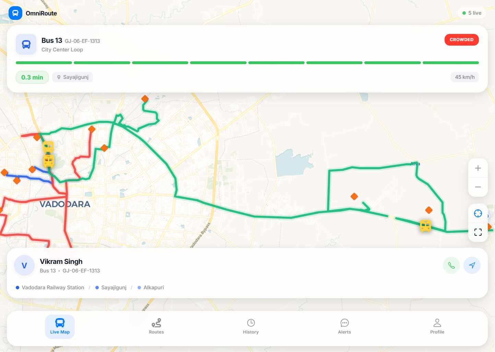

<p align="center">
  <h1 align="center">OmniRoute</h1>
  <p align="center">Real-time smart transit tracker for Vadodara city</p>
  <p align="center">
    
    
    
    
    
  </p>
</p>

---

<p align="center">
  
</p>

Live bus positions on a map, real-time ETAs, occupancy status, and rider alerts — all powered by WebSockets with 3-second update intervals.

## Tech Stack

| Layer | Tech |
|-------|------|
| Backend | Django · DRF · Daphne (ASGI) · Channels |
| Frontend | React · Leaflet · Zustand · Tailwind CSS |
| Database | PostgreSQL (Neon) |
| Real-time | WebSocket via Django Channels |
| Background | Celery + Redis |
| Routing | OSRM (road-snapped geometry) |

## Getting Started

### Local Development

```bash
# backend
cd backend
python -m venv venv && venv\Scripts\activate   # Windows
pip install -r requirements.txt
python manage.py migrate
python manage.py seed_demo
python manage.py runserver_with_sim             # starts server + bus simulator

# frontend (new terminal)
cd frontend
npm install && npm start
```

### Docker

```bash
cp .env.example .env
docker-compose up --build
```

| Service | URL |
|---------|-----|
| Frontend | `http://localhost:3000` |
| API | `http://localhost:8000/api/` |
| Admin | `http://localhost:8000/admin/` |

## API Overview

```
GET  /api/transit/routes/       Routes with stops + GeoJSON
GET  /api/transit/buses/        Buses with driver details
GET  /api/tracking/live/        Live positions
GET  /api/tracking/eta/:id/     ETA to next stop
POST /api/tracking/gps/         GPS webhook (simulator)
POST /api/accounts/login/       Authentication
```

## Architecture

```
Bus Simulator → POST /api/tracking/gps/
  → PostgreSQL (history)
  → In-memory cache (live state)
  → WebSocket broadcast → Connected clients
```

## Demo Credentials

| Role | Username | Password |
|------|----------|----------|
| Rider | `demo` | `demo123` |
| Admin | `admin` | `admin123` |

## License

[MIT](LICENSE)
